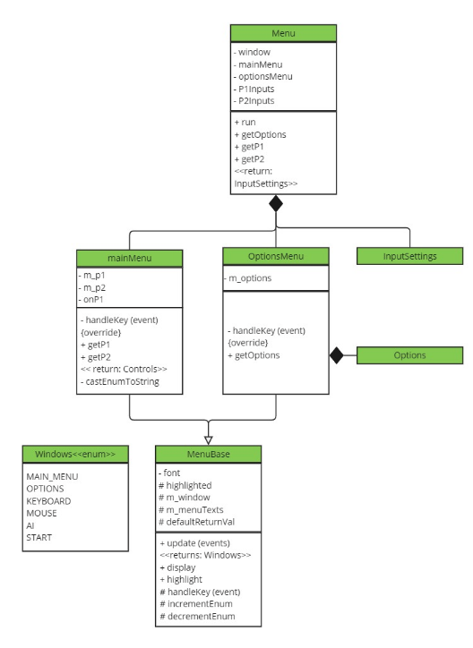
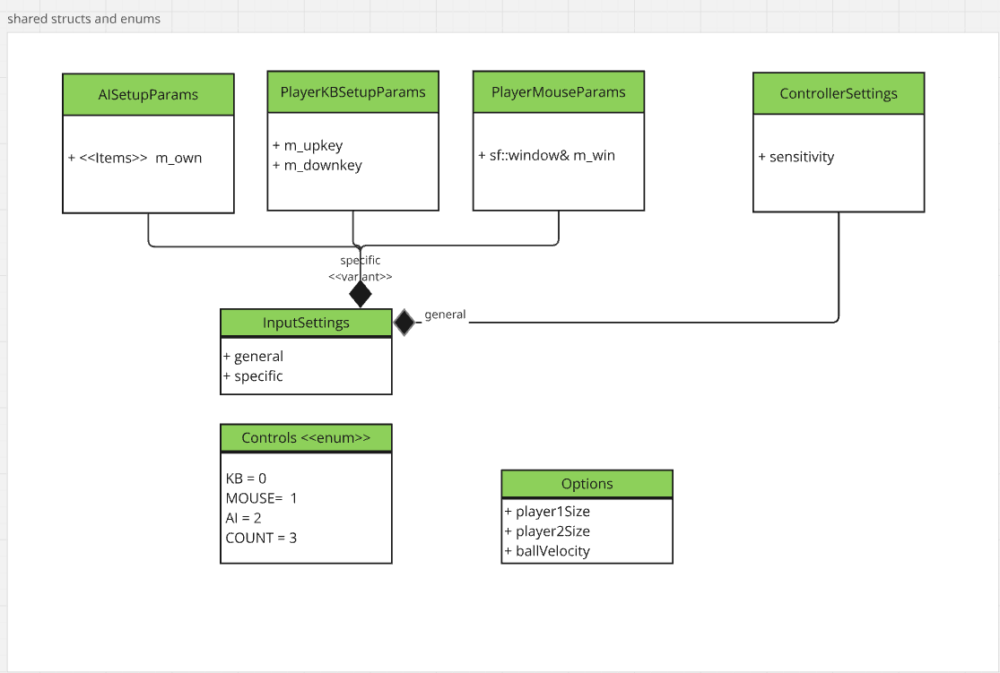
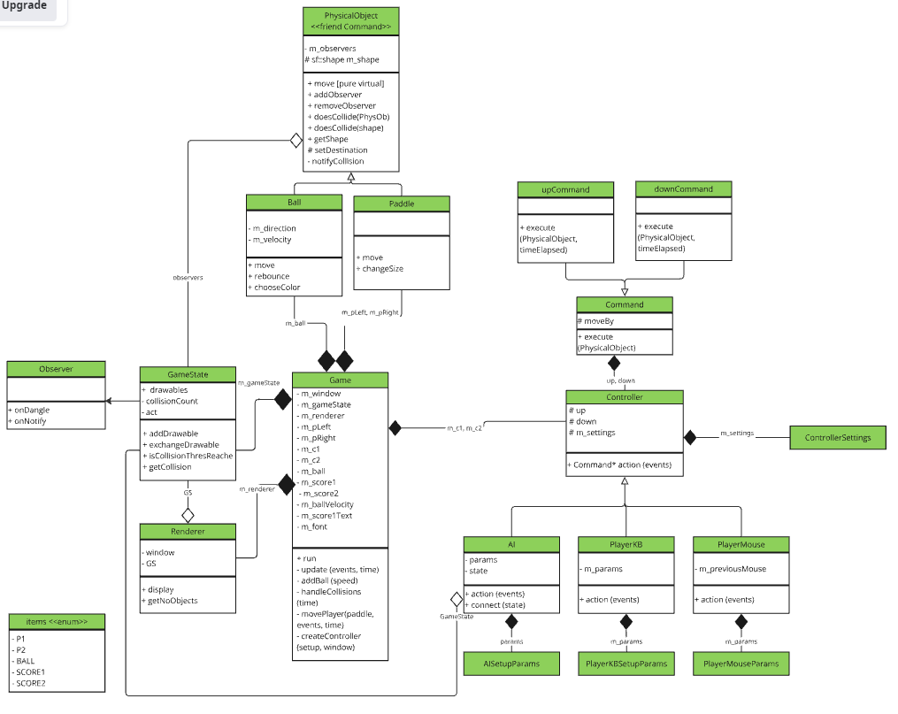

# Overview  
This is a Pong game for demonstration purposes. It is on purpose created like a larger game engine (and a bit overengineered) to demonstrate various design patterns and architecture considerations.
Patterns are mostly implemented manually (observer, command, etc.), but for the Event Loop and rendering purposes SFML was used.  
Menu and core game logic are separately compiled. Two versions of the menu exist: a state-based manual implementation using SFML for rendering, and a qt-based version. 

[work in-progress, qt replacing the SFML-based version. currently 2 menus show up on running]

Rules mostly follow standard Pong implementations, with some exceptions:
- Each side can be occupied by user or AI, and user can play with keyboard or mouse
- Paddle sizes, initial ball velocity and AI difficulty can be set by user
- The ball deflects from paddles according to standard physics (angle of deflection = angle of incidence)
- The ball nevertheless travels with constant velocity and speed is not affected by friction or collisions
- Power items may randomly show up, changing e.g. velocity or paddle sizes
- After a few collisions, the ball is replaced by a new ball with higher velocity

# How to play
In the main menu, use arrow keys on Player1 and Player2 to choose between Keyboard, Mouse and AI.
Hit Return on Options to set further settings, or on Start to begin the game.
Keys for Keyboard control are W and S for either player. An option to change keybindings will be added later.
[works for both menus, but game only responds to qt-based menu]

# Repository overview  
The game menu and the game itself are built as libraries (game and sfml-menu dynamic, qt menu static). A main executable is placed in the root folder, and CMake is used to compile. Folders:  
- doc: resources for this documentation
- Game: builds the game as shared library
- include: header files
- menu: builds the menu as shared library 
- qtMenu: builds the menu  as static library
- tests: unit tests for the game

# class overview and design decisions  

## Menu  

All menus derive from a common base class (MenuBase) which allows displaying, scrolling through and highlighting text items. The return type of its update function is an enum (Windows), describing which menu shall be opened next.   
InputSettings and Options: see section "Shared objects" below.

The main Menu saves the current selection of player types, the optionsMenu current general options (speed, paddle size), and a future Keyboard menu will save keybindings.  
The main class Menu is actually called MenuImpl in the code (Menu is the public-facing API), shortened here for clarity. It contains all menus and manages switching between them, and it responds to external queries.  
The menu will only be called once. To avoid unneccesary copies and clarify ownership, objects are moved upon query (not yet for options, passed as const ref). 

## Qt-based Menu
This version of the menu benefits from the Signal/slot logic. This makes it much easier to switch between submenus in comparison to returning a state enum ("nextWindow: Windows::mainMenu")).  

Instead of inheriting submodels storing different contents, the Menu holds a more generic vector of items (type-safe variants) and otherwise handles the movement logic only. Thus there is no need to derive multiple submenus. 

The parent system makes it easier to consistently style child labels, and memory safety is also guaranteed. 

## Shared objects  
Shared objects concern the controller settings and options, which are output of the menu, and input to the game.  

InputSettings contains a general and a controller-specific part. Std::variant is used to store the controller-specific part (Keyboard, Mouse, AI) in a single object.  
Because all shared objects are simple structs, they are trivially movable.
[- note: keyboard settings currently stores SFML::keys which Qt cannot provide. needs update to store char.]

## Game    
The core of the game consists of a Game object, Ball and Paddle. Balls and Paddles must be movable, visible on screen, and able to collide. The game additionally needs inputs regarding general settings (ball speed) and type of control (AI/keyboard,mouse).

  

**Inputs to Game**  
The game (GameImpl in the code) requires controller settings and options upon startup. These structs are passed by value (options currently as const ref) and moved to the appropriate object (zero-copy transfer); the inputSettings struct is decomposed and the variant resolved in the process.The settings end up in the Controller class, with general settings in the base Controller and specific settings in the appropriate derived class (AI/PlayerKB/PlayerMouse). The Controller classes are used to store/cue movement commands (see below).

**Visibility and collision**  
The PhysicalObject has a shape which is used for displaying and calculating collisions with other shapes. GameState tracks the identity of all objects that are currently in the game.
Renderer and AI can query the GameState to draw objects/to react to ball movement. 

**Observers and game state:**  
The game state class is a central registry that can update other classes about the current position and shape of each object. This ensures that all entities react to the same information
and avoids coupling. 
Other notable events are signalled via an observer pattern (e.g. collisions of objects), and the gameState doubles as observer. This allows e.g. counting the total number of game-
wide collisions, and trigger changes in difficulty or color as the game progresses (independent of score). For example, the game turns cyan as soon as three collisions were detected, and 
the ball speed increases and ball color changes on every 15 collisions.
To demonstrate the versatility of the observer pattern, another observer (Sound) is added, and it plays a sound on various notable events (scores, collisions). It is independent of 
gameState and hooks directly on various Objects (paddles ball - currently the same as game state but may also be a smaller or larger subset in the future). It does not yet use sfml::sound but a simple command line output.
The observer pattern follows classic GoF style, and observers are attached as raw pointers. To prevent observers from holding a dangling pointer, all PhysicalObjects (observed entities) emit a death notice when the destructor is called (onDangle())). No Fallback on RAII(as with smart pointers), but faster.

**Controllers and object movement:**  

The PhysicalObject class contains the current shape and can be moved around. There are in principle two forms of movement: based on physics (gravity, impulse etc), and based on 
game mechanics (control by AI, player or power items). The setDestination function of PhysicalObject is a basic setter that does not contain either, so access is restricted by making
it a protected member. The derived classes (Ball, Paddle etc) add physics via the exposed public function move(). Currently, only Ball movement is based on physics, but in the future, 
Paddles may include physics-based movement as well, e.g. impulse upon being hit by a ball, gravity etc.  
Game movement mechanics are encapsulated in a command pattern. Commands are friends with PhysicalObject, so only they are able to access the protected setter and move Paddles according
to their own logic (up or down), and ignoring physics. Usage of a command patterns separates the physical constraints of movement from those imposed by game logic.
 
Controllers fetch commands (from players or AI) and are able to return (or queue) them. Game is responsible for matching controller outputs (commands) with other objects (paddles). 
Game may have its own way of interfering with the objects as well, e.g. using commands on ball to make the ball wiggle, or on paddles to prevent them from leaving the screen. This design
allows abstract control of any object, by human, AI or the game environment without entangling the classes. Currently implemented controls are keyboard, mouse and AI.

# Isssues  
- ball jumps a bit when hitting a wall, particularly noticeable if hitting at small angles
- keybinding menu to write, possibly also menus for AI difficulty and mouse sensitivity
- if player uses mouse, paddle moves with constant speed into direction of mouse. Could instantly go to current mouse pos instead, to track the mouse more closely
- sound is missing in UML
- balls are placed with random initial direction. Sometimes they fly (almost) vertical and it takes long to reach the player